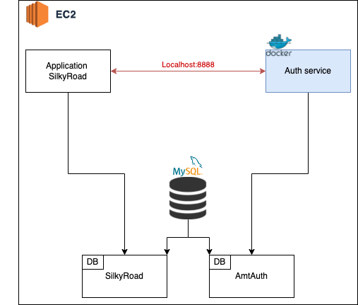

# Service d'authentification de Silkyroad 🐪
AMT AUTH est un service permettant l'authentification d'utilisateurs de l'application [SilkyRoad](https://github.com/EricB2A/PRO_AMT).
Le service permet d'inscrire un nouvelle utilisateur et de loguer ceux existant en leur fournissant un `JWT` qui pourront
envoyer avec leurs requêtes faites sur le site Silkyroad afin de les authentifier.

## Architecture logicielle 🏛


Le service d'authenfication est packagé dans un container docker qui est hébergé sur [Docker Hub](https://hub.docker.com/).

Un déploiement se fait en 2 étapes : 
- Dans un premier temps, [Docker-image.yml](.github/workflows/docker-image.yml) créé une nouvelle image docker contenant la dernière version du code.
Cette nouvelle image est ensuite déployée sur docker hub.
- Dans un second temps, [CD.yml](.github/workflows/CD.yml) se connecte à l'instance EC2 et lance un script qui a pour but de télécharger sur docker hub la dernière version de l'image, et lance le container associé

## Routes 👀
La spécification de l'API est disponible ici :
[Swagger hub](https://app.swaggerhub.com/apis/noahfusi/AMT_Silkyroad_Auth/V1.0-oas3)
Les routes disponibles sont 

| Verbe HTTP | Route                 | Contrôleur            |
|------------|-----------------------|-----------------------|
| POST       | `/accounts/register`  | `AuthController`      |
| POST       | `/auth/login`         | `AuthController`      |

## Structure
- Le dossier `src` contient le code source du projet.
- Le dossier `docs` contient tous les éléments utiles à la documentation (fichiers sources, images).

## Commencer 🏁
Cette section a pour but de mettre en place un **environnement de développement** similaire à celui de l'équipe de développement.
### Prérequis
- [Java](https://www.java.com/fr/download/) : *1.8*
- [Maven](https://maven.apache.org/download.cgi) :  *3.8.**
- [Docker engine](https://docs.docker.com/engine/install/) : *20.10.**
- [Docker compose](https://docs.docker.com/compose/install/)
    - *NOTE: docker compose est inclus dans les installation de l'engine sur Windows et MacOS*.
- [IntelliJ IDEA](https://www.jetbrains.com/idea/download/)

### Installation
1. Cloner le repository.
```bash 
git clone git@github.com:EricB2A/PRO_AMT.git # nécessaire pour le Docker de la DB
git clone git@github.com:EricB2A/PRO_AMT_AUTH.git  
```
2. Ouvrir le projet avec IntelliJ
3. Lancer le conteneur Docker qui se trouve dans le `PRO_AMT` 
```bash
cd PRO_AMT/docker/docker-mysql && touch silkyRoad.sql && docker compose up
```
4. Lancer Spring boot et le Tomcat Server *(^R)*.
5. Vous pouvez maintenant accéder au service à l'adresse `http://localhost:8082/<URI>`

### Variables d'environnement
Afin de pouvoir utiliser notre application en local, il faut ajouter plusieurs variables d'environnement :

* JWT_SECRET
* DB_PASSWORD
* MYSQL_PORT
* APP_ADMIN_PASSWORD

Pour ajouter des variables d'environnement, aller sous Run->Edit Configuration

Dans la configuration Spring Boot correspondant à l'application, sous Environment -> environment variables, cliquez sur l'icône de bloc note
et ajoutez les deux variables ci-dessus avec leur valeurs respectives

## Modèle de domaine 💡
Vous pouvez vous baser sur la classe `User` du modèle du domaine sur [SilkyRoad](https://github.com/EricB2A/PRO_AMT). La base de 
données étant partagé entre les 2 services.

L'ORM [Hibernate](https://hibernate.org/) va faire un mapping 1-1 entre ce(s) classe(s) et ses(leurs) attributs et une table
éponyme et ses champs associés en base de données. Veuillez noter que les méthodes de types `setter` et `getter` ne sont
pas présents sur ce schéma afin de simplifier la lisibilité de ce dernier.

## Authentification
Documentation du login se trouve [ici](docs/Authentification.md).

Un service d'authentification a été implémenté et est disponible dans [ce repo](https://github.com/EricB2A/PRO_AMT_AUTH)

